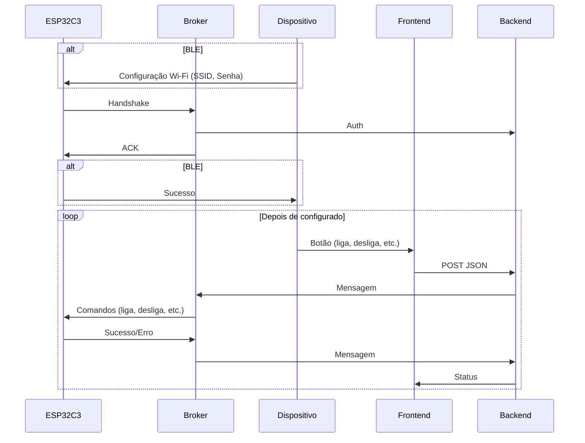

# Tomada inteligente

Implementação em Rust do firmware da tomada inteligente e do seu broker

## Compilação

É necessário ter o `cargo` instalado no seu sistema: [https://rustup.rs/](https://rustup.rs/)

```bash
rustup toolchain install nightly --component rust-src
rustup target add riscv32imc-unknown-none-elf
cargo install espflash
```

```bash
# Firmware
cd embed
cargo build -r
# Se tiver o ESP32C3 conectado por USB
cargo run -r
```

```bash
# Broker
cd broker
cargo build -r
cargo run -r
```

### Docker (broker)

#### Dependências

- just
- tomlq
- pv
- docker (obviamente)

#### Build

```bash
just build_docker
```

#### Deploy

```bash
# alvo do commando SSH
SSH_HOST=exemplo@192.168.0.0
just ssh=$SSH_HOST deploy_docker
```

## Software

- [Tomada](embed)
  - [ESP-RS](https://github.com/esp-rs)
  - [ESP-HAL](https://github.com/esp-rs/esp-hal) (oficial da Espressif)
  - esp-hal-embassy
  - embassy-net
  - trouBLE
  - agnóstica em relação à tomada física utilizada
  - se comunica com dispositivo do usuário usando BLE para configuração inicial
- [Broker](broker)
  - meio de campo entre backend e ESP32C3
  - MQTT? UDP? TCP? WebSocket?
  - TLS (SOCORRO)
  - autenticação

### Status

| Tarefa               | Status |
|----------------------|:------:|
| Broker               |   🚧   |
| Dispositivo mock     |   ❌   |
| Autenticação         |   ❌   |
| Testar estabilidade  |   🚧   |
| Mensagens/comandos   |   ✅   |

### Diagrama de fluxo



## Hardware

- ESP32C3
- Trocar MCU interno por um próprio
  - o interno é Bekken (ultra dificil de usar)
  - só 3 pinos
  - 3.3V incluso
- Interruptor inteligente Ekaza

### Status

| Tarefa               | Status |
|----------------------|:------:|
| Wi-Fi                |   ✅   |
| BLE                  |   ❌   |
| Controle de hardware |   ✅   |
| Montagem             |   ❌   |
